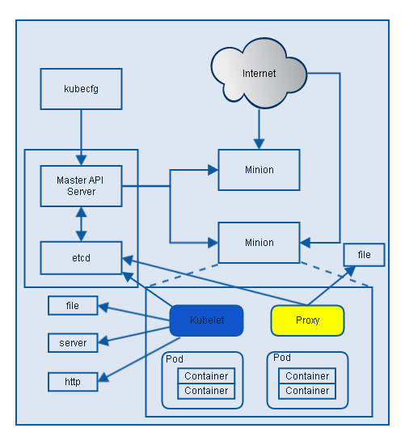

## Kubernetes


### 介绍
* 是Google开源的容器集群管理系统，它提供部署、维护、扩展等机制，跨机器容器化的应用能很好的进行管理。
* 它使用Docker对应用进行打包，实例和运行
* 以集群的方式进行运行、管理跨机器的容器
* 解决Docker容器跨机器的通信问题
* 对容器集群进行管理，动态扩容和保证集群运行状态

### 核心概念

* Pods
Pod是Kubernetes中基本的操作单元，把相关的一个或者多个容器构成一个Pod, 这些容器共享相同的volumes和Network namespace IP/port. 注意： Pod包含的容器运行在同一个Host上
* Services
Service也是Kubernetes的基本操作单元，是真实应用服务的抽象，每个服务后面都有很多对应的容器来支持。通过Proxy的port和服务selector来决定服务请求传递给后端提供服务的容器，对外部表现为单一的访问接口。

* Replication controller

确保在Kubernetes集群内任何时候都有制定数量的Pod运行。比如：启动新的container来增加Pod, 或者杀死Pod来减少数量。它依赖预先创建的Pod模板。主要的使用方法：

1. Scaling

	支持动态扩容
	
2. Rescheduling

	支持pod数量的稳定
	
3. Rolling update

	支持滚动式升级

4. Multiple release tracks 

	根据label去区分，确保多个release task运行

* Labels

	Labels是用于区分Pod、Service、Replication Controller的key/value键值对，Pod、Service、 Replication Controller可以有多个label，但是每个label的key只能对应一个value。Labels是Service和Replication Controller运行的基础，为了将访问Service的请求转发给后端提供服务的多个容器，正是通过标识容器的labels来选择正确的容器。同样，Replication Controller也使用labels来管理通过pod 模板创建的一组容器，这样Replication Controller可以更加容易，方便地管理多个容器，无论有多少容器。


#### 架构


Kubernetes集群管理的整个流程为（我们以创建Pod为例）：

1. kubecfg将创建Pod的请求发送到Kubernetes client
2. Kubernetes Client将请求发送给API server。
3. API Server根据请求的类型，这里创建Pod时storage类型是pods, 选择Pod REST Storage API对请求作出处理。
4. REST Storage API对的请求作相应的处理。
5. 将处理的结果存入高可用键值存储系统Etcd中。
6. 在API Server响应Kubecfg的请求后，Scheduler会根据Kubernetes Client获取集群中运行Pod及Minion信息。
7. 依据从Kubernetes Client获取的信息，Scheduler将未分发的Pod分发到可用的Minion节点上。

* Master API Server

提供API资源管理入口。所有需要操作资源的，都通过它的API来进行访问。

从上图可以看出Api server是kubernetes的总入口，通过它来接收所有的参数，并调用storage api来处理不同资源的应用。

* Kubelet

它与API server通信，负责调度和控制minion上的Pod, 并与etcd, file等通信，读取相关的配置信息。




* Proxy

Proxy在Minion上，为service提供负载均衡和路由。 Proxy提供TCP/UDP socket的proxy, 它从etcd中读取services和Endpoint的信息，然后在minion上启动进程并监听相应的服务。

#### Kubernete部署

[部署](https://blog.csdn.net/u010884123/article/details/56485246)

[官方文档](https://kubernetes.io/docs/setup/)

* etcd server    install etcd 

  etcd的集群部署方式有三种，分别是静态配置，etcd自发现模式，及DNS发现模式

* kubernete master  install kubernetes-master
* kubernete node  install kubernetes-node flannel docker

	[flannel工作原理](http://dockone.io/article/618)
	
#### 在本机搭建kubernets环境
* 搭建centos环境

	1. 下载centos docker image
	
	```
		docker pull centos
	```
	
	2. 运行centos docker
	
	```
	docker run -t -i centos:latest /bin/bash

	```


* 修改results-ui支持docker部署
* 搭建docker registry环境
* 搭建etcd server

	a. download the etcd project
	
	```
		docker pull kubernetes/etcd
	```
	
 	```
 	docker network create --subnet 172.16.0.0/16 --gateway 172.16.0.1 docker-net


 	
 	docker run --privileged  -ti -e container=k8 -v /sys/fs/cgroup:/sys/fs/cgroup k8-3:latest /usr/sbin/init
 	```
Step 4: Start services on Master and Minion

On Master

	systemctl enable kube-apiserver
	systemctl start kube-apiserver
	systemctl enable kube-controller-manager
	systemctl start kube-controller-manager
	systemctl start kube-scheduler
	systemctl start kube-scheduler
	systemctl enable flanneld
	systemctl start flanneld
	
On Minions

	systemctl enable kube-proxy
	systemctl start kube-proxy
	systemctl enable kubelet
	systemctl start kubelet
	systemctl enable flanneld
	systemctl start flanneld
	systemctl enable docker
	systemctl start docker
* 搭建kubernetes server
* 搭建kubernetes node
* 部署results-ui 


